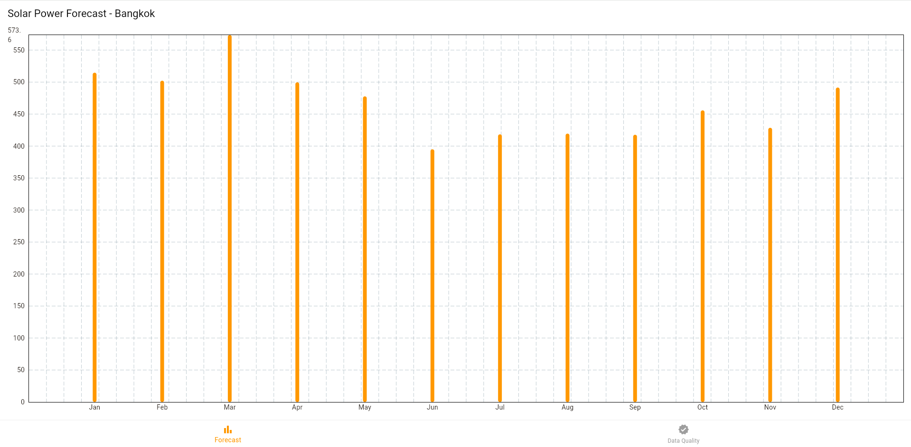
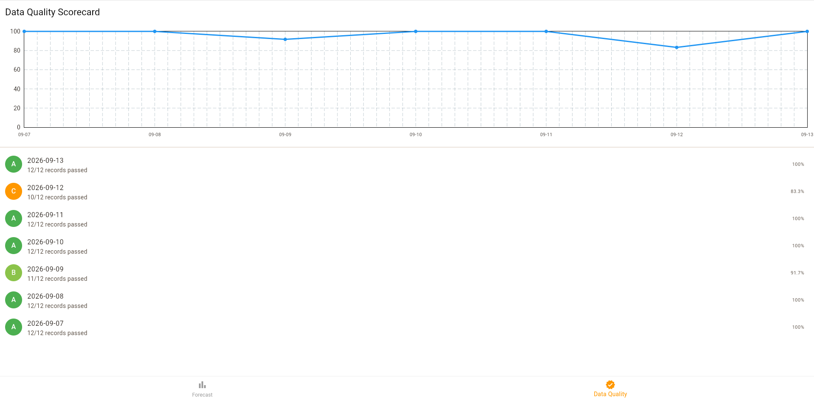

# Solar Forecast App

A Flutter app with two views: a monthly solar power forecast chart, and a data quality scorecard that tracks how much of each day's pipeline data passed validation — the final "view" layer in a pipeline that goes from raw API data to something a user can actually read and trust.

## What it does

**Forecast tab** — Loads a bundled JSON file (`assets/solar_forecast.json`) containing 12 months of forecasted AC power output for a solar installation in Bangkok, and renders it as a bar chart using `fl_chart`.

**Data Quality tab** — Loads `assets/quality_log.json`, a daily log produced by the [Solar Data ETL Pipeline](https://github.com/Pannawat-KO/solar-etl-pipeline)'s data contract validation. Renders a line chart of each day's quality score (0-100%) plus a list of daily entries with letter grades (A-F) and a pass/fail record count, so a data quality issue is visible at a glance instead of buried in a log file.

## How it fits with the other projects

This app is the last stage of a 3-part pipeline:

```
Solar Data ETL Pipeline           →  solar_forecast.json  →  Solar Forecast App (this repo)
(API → SQLite → S3, with a         →  quality_log.json     →  Forecast tab + Data Quality tab
 data contract + chaos-tested
 validation on every run)
```

The JSON files consumed here are generated by the [Solar Data ETL Pipeline](https://github.com/Pannawat-KO/solar-etl-pipeline): `solar_forecast.json` holds the forecast data, and `quality_log.json` holds each day's validation results (records passed/failed, score, grade). Right now the app reads static copies of both bundled as Flutter assets; neither is pulled live from the pipeline's output.

## Screenshots

**Forecast tab**


**Data Quality tab**


## Tech stack

Flutter · Dart · fl_chart

## Setup

1. `flutter pub get`
2. Make sure `assets/solar_forecast.json` and `assets/quality_log.json` are present and declared under `flutter: assets:` in `pubspec.yaml`
3. `flutter run`

## What I'd improve next

- Pull both JSON files from the pipeline's AWS S3 bucket at runtime instead of bundling static copies, so both tabs always reflect the latest pipeline run instead of whatever was bundled at build time
- Add a pull-to-refresh gesture to trigger that fetch
- Fix the duplicate x-axis date labels on the quality chart when there are more days of history than fit comfortably
